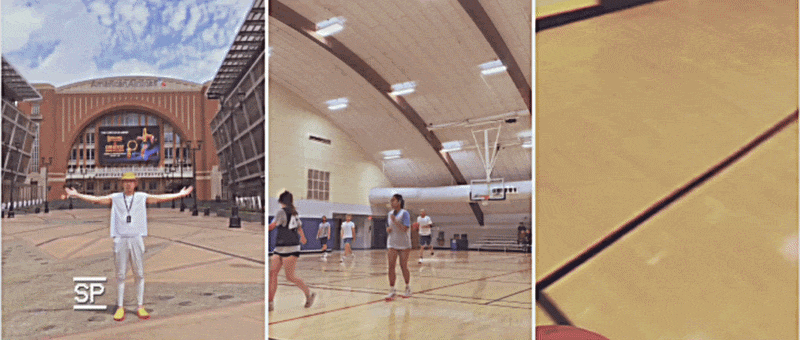

# 💻 Welcome to Xiangyu's Github Page!

## 💫 About Me

* 🌱 I'm a Ph.D. Candidate in Systems Design & Robotics at the **University of New Hampshire**.

* 🔭 My work focuses on the intersection of **Control Theory, Robotics, and Machine Learning**. I specialize in autonomous systems, model predictive control, and real-time optimization.

* 💬 Ask me about ...
  
* ⚡ Fun fact: I retired from my NBA 🏀 dreams at age 12.

  

---

## 🛠️ Tech Stack

**Languages:** Python, C++, C, MATLAB, SQL, R, JavaScript  
**Robotics & Frameworks:** ROS, PyTorch, TensorFlow, Simulink, SolidWorks  
**Tools & Platforms:** Linux, Git, GitHub, VS Code, LaTeX  
**Foundations:** Autonomous Systems, Optimal Control, Reinforcement Learning, Systems Modeling  

 

  

---

## 🚀 Projects

<!-- You can add your projects below in the future -->

**[Project Name 1](https://github.com/CyberXiangyu)** · `Python` `ROS` `PyTorch`  
Brief one-sentence description of the project, algorithm, or hardware setup.

**[Project Name 2](https://github.com/CyberXiangyu)** · `C++` `Control Theory`  
Brief one-sentence description of the project, algorithm, or hardware setup.

---

## 🌐 Connect

  
  

